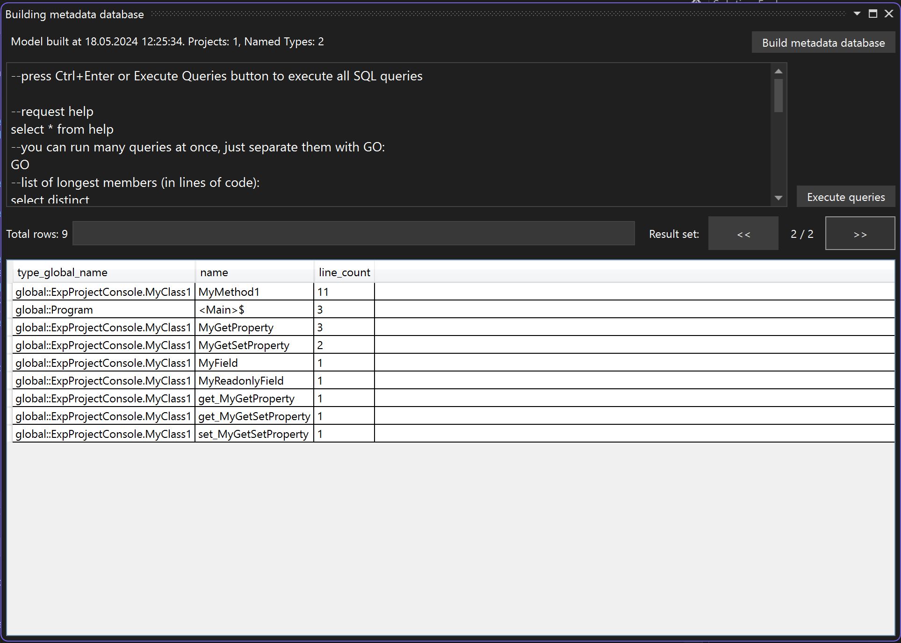

# Relational Roslyn Visual Studio Extension

This extension puts Roslyn metadata of your project into the in-memory sqlite database and allows to you to execute queries to the database.



For example, you can search for an async methods without `Async` suffix:

```
select distinct
    nt.type_global_name,
    mm.name
from named_types nt
join member_methods mm on mm.id_named_type = nt.id
where
    mm.is_async = 1
    and mm.name not like '%Async'
```

or you can sort all your members by their line count:

```
select distinct
    nt.type_global_name,
    mm.name,
    LENGTH(ss.source) - LENGTH(REPLACE(ss.source, X'0A', '')) + 1 line_count
from named_types nt
join members mm on mm.id_named_type = nt.id
join symbol_source ss on ss.id = mm.id_source
order by
    line_count desc
```

or you can search all your members with `TODO` word:

```
select distinct
    nt.type_global_name,
    mm.name,
    ss.source
from named_types nt
join members mm on mm.id_named_type = nt.id
join symbol_source ss on ss.id = mm.id_source
where
    ss.source like '%TODO%'
```

This is a regular sqlite SQL syntax, you can do whatever you need, no additional restriction exists.

Consider giving a star if this extension was helpful for you.